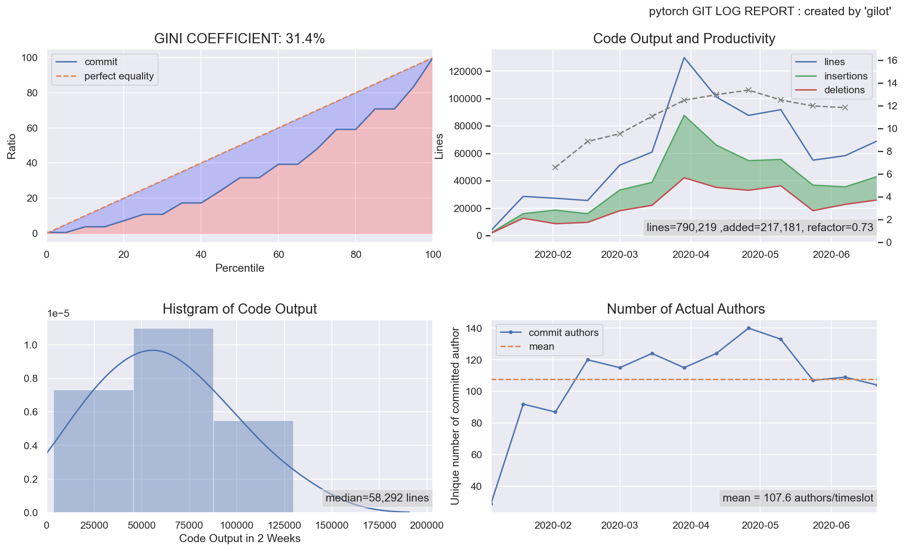
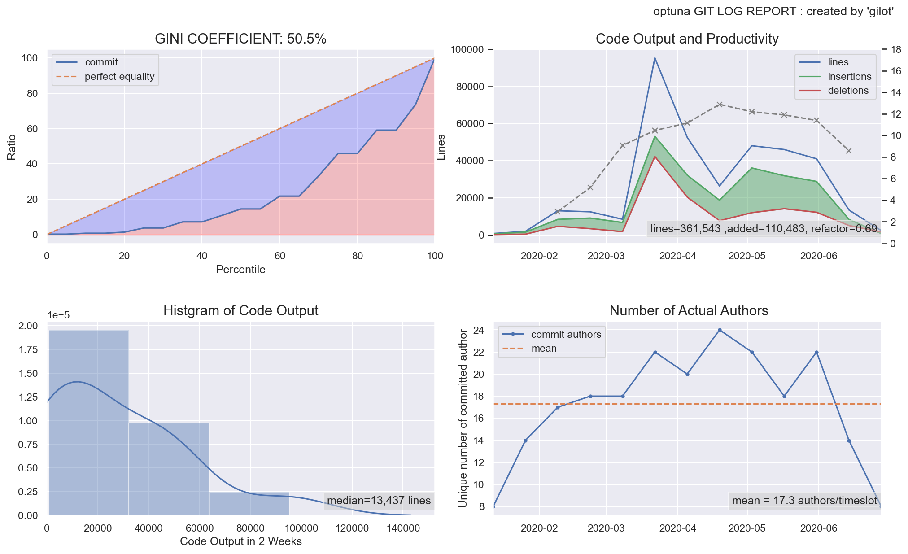
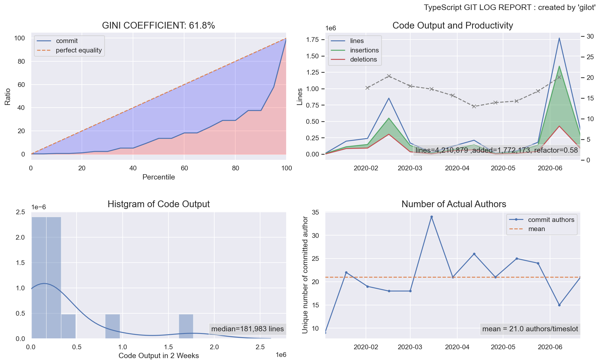

# gilot

"gilot" is a tool to analyze and visualize git logs.

One of the most reliable records of a software project's activity is the history of the version control system. This information is then used to create graphs to visualize the state of the software development team in a mechanical way.

"gilot"  creates four graphs.

- The first graph shows the bias in the amount of code changes for a given time slot as a Gini coefficient and a Lorentz curve. The closer the Gini coefficient is to 1, the more unequal it is, and the closer it is to 0, the more perfect equality it is an indicator of economics. It tends to go down when a project has stable agility, and the more volatile and planaristic the project, the closer it is to 1.

- The second graph shows a histogram of the bias in the amount of code changes in a given time slot.

- The third graph shows the change in the amount of code changes per time slot. It is displayed in green when the total amount of codes is increasing and in red when the total amount of codes is decreasing.

- The fourth graph shows the number of authors who committed per given time slot. The effective team size is estimated.

## Installation

just:
    pip install gilot
or 
    pip install git+https://github.com/hirokidaichi/gilot

## Usage

### simple way (1 liner using pipe)
    gilot log REPO_DIR | gilot plot

### 2-phase way

    gilot log REPO_DIR > repo.csv
    gilot plot -i repo.csv -o graph.png

## Command 
``gilot`` has 3 commands, ``log`` and ``plot`` and ``info``
+  ``log`` command generates a csv from the repository information

+  ``plot``  command generates a graph image (or matplotlib window) from that csv.

+ ``info``  command, like the plot command, takes a csv file as input and outputs only JSON format statistical information.

### gilot log (generate csv)
The simplest way to use the ``gilot log`` command is to specify the repository directory as follows. This means saving the output as a CSV file.

    gilot log REPO > REPO.csv
    gilot log REPO -o REPO.csv

The default period is six months, but you can specify the time.

    gilot log REPO --since 2020-01-20 -o REPO.csv
    gilot log REPO --month 18 -o REPO.csv

By specifying a period of time, such as when you want to see the stability of the service after the launch, you can eliminate the impact of commits during the initial release.

    gilot log REPO --branch develop -o REPO.csv

You can use the branch option to see what the development branch looks like, or to see the results for each branch. By default, ``origin/HEAD`` is specified. This is because we want to see how well we can develop in a trunk-based way.

All options are here

    usage: gilot log [-h] [-b BRANCH] [-o OUTPUT] [--since SINCE] [--month MONTH]
                    repo

    positional arguments:
    repo                  REPO must be a root dir of git repository

    optional arguments:
    -h, --help            show this help message and exit
    -b BRANCH, --branch BRANCH
                            target branch name. default 'origin/HEAD'
    -o OUTPUT, --output OUTPUT
    --since SINCE         SINCE must be ISO format like 2020-01-01.
    --month MONTH         MONTH is how many months of log data to output.
                            default is 6
### gilot plot (generate graph)

The simplest way to use the ``gilot plot`` command is to take the CSV file output from the gilot log command as input and specify the name of the file you want to save as output, as shown below.

    gilot plot -i TARGET.csv -o TARGET_REPORT.png
    gilot plot --input TARGET.csv -o TARGET_REPORT.png

Also, since the input from the standard input is also interpreted as a CSV, it can be connected to a pipe as shown below.

    cat target.csv | gilot plot 
    gilot repo . | gilot plot

For example, if one team is working in a *multi-repository* services, you may want to know the activity of multiple repositories as a whole, instead of focusing on one repository. In this case, you can combine multiple inputs into a graph as follows.

    gilot log repo-a > repo-a.csv
    gilot log repo-b > repo-b.csv
    gilot plot -i repo*.csv

All options are here:

    usage: gilot plot [-h] [-i [INPUT [INPUT ...]]] [-t TIMESLOT] [-o OUTPUT]
                    [-n NAME]

    optional arguments:
    -h, --help            show this help message and exit
    -i [INPUT [INPUT ...]], --input [INPUT [INPUT ...]]
    -t TIMESLOT, --timeslot TIMESLOT
                            resample period like 2W or 7D or 1M
    -o OUTPUT, --output OUTPUT
                            OUTPUT FILE
    -n NAME, --name NAME  name

### gilot info (dump statistical infomation)

``info``  command, like the plot command, takes a csv file as input and outputs only JSON format statistical information.

    # gilot info -i sample/react.csv
    {
        "gini": 0.42222013847205725,
        "output": {
            "lines": 242999,
            "added": 70765,
            "refactor": 0.7087848098140321
        },
        "since": "2019-12-03T10:53:08.000000000",
        "until": "2020-05-30T06:34:43.000000000",
        "timeslot": "2 Weeks",
        "insertions": {
            "mean": 11205.857142857143,
            "std": 10565.324647217372,
            "min": 781.0,
            "25%": 3788.75,
            "50%": 8544.0,
            "75%": 16761.25,
            "max": 39681.0
        },
        "deletions": {
            "mean": 6151.214285714285,
            "std": 4437.0289466743825,
            "min": 327.0,
            "25%": 3397.0,
            "50%": 5076.0,
            "75%": 9333.75,
            "max": 13477.0
        },
        "lines": {
            "mean": 17357.071428571428,
            "std": 14236.531424279776,
            "min": 1108.0,
            "25%": 7383.25,
            "50%": 12860.0,
            "75%": 26531.75,
            "max": 52914.0
        },
        "files": {
            "mean": 377.7857142857143,
            "std": 271.95196933718574,
            "min": 70.0,
            "25%": 155.75,
            "50%": 402.0,
            "75%": 450.0,
            "max": 1062.0
        },
        "authors": {
            "mean": 13.357142857142858,
            "std": 4.70036238958302,
            "min": 4.0,
            "25%": 10.0,
            "50%": 15.0,
            "75%": 16.0,
            "max": 21.0
        },
        "addedlines": {
            "mean": 5054.642857142857,
            "std": 7742.596112089604,
            "min": -1210.0,
            "25%": 266.5,
            "50%": 2062.5,
            "75%": 5770.75,
            "max": 26448.0
        }
    }
Integration with ``jq`` command makes it easy to get only the information you need.

### When only the Gini coefficient is required
    # gilot info -i sample/react.csv | jq .gini
    > 0.42222013847205725

### If you want to find the total number of lines in all commits in a period

    # gilot info -i sample/react.csv | jq .output.lines

## Example Output

### facebook/react

### tensorflow/tensorflow

### pytorch/pytorch

### optuna/optuna

### microsoft/TypeScript

## As a package in python

 